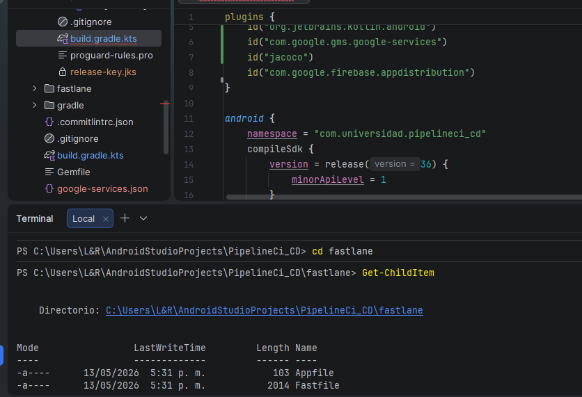
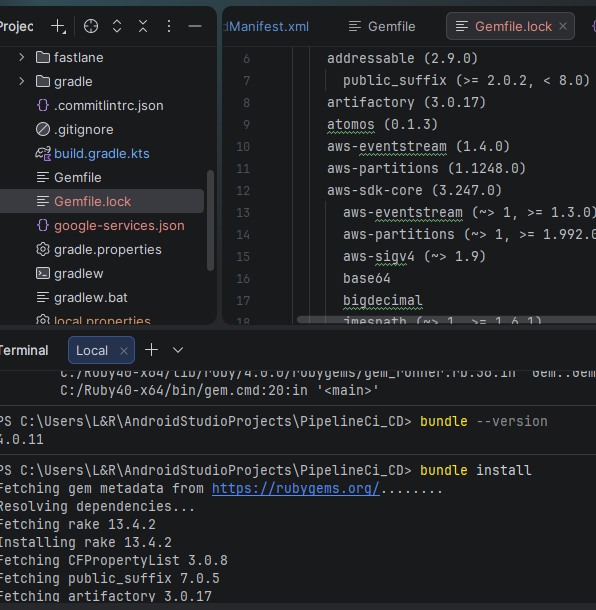
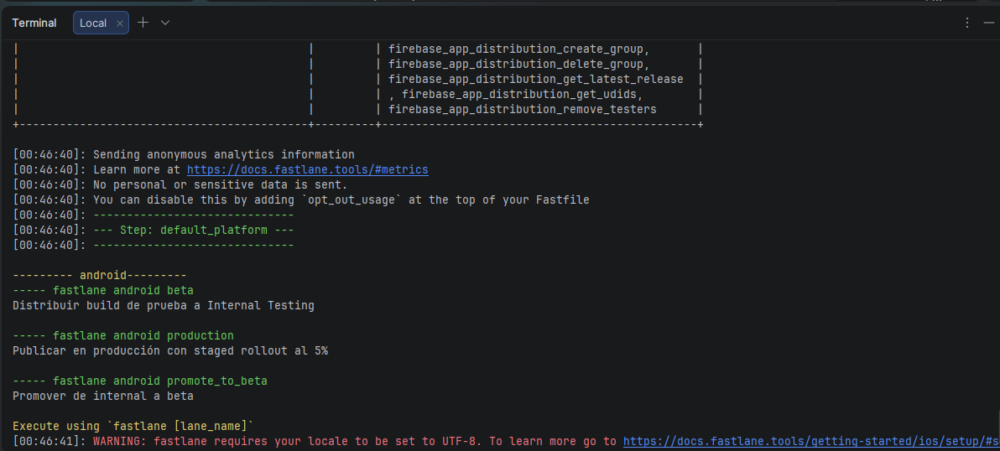
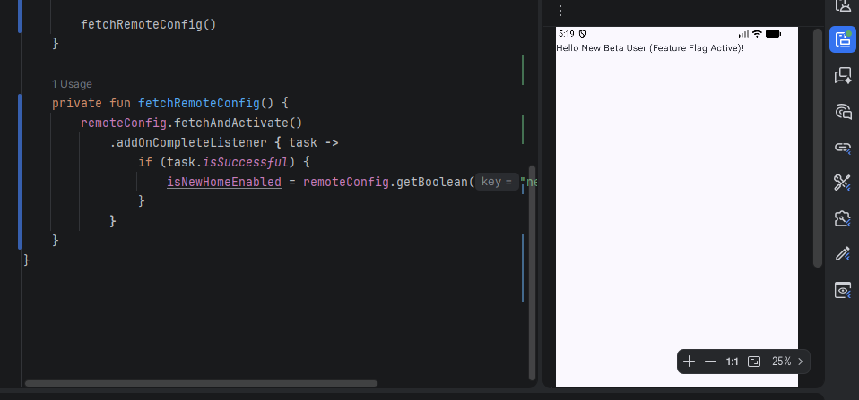
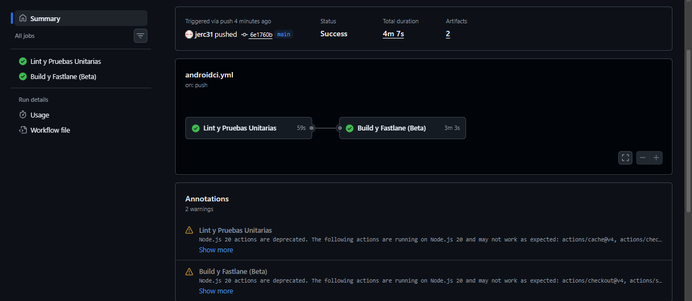

# Automatización del Ciclo CI/CD, Publicación y Operación en Android

## Información del Estudiante

**Nombre:** Ángel Rizo Arias  
**Código:** 02230131027  
**Programa:** Ingeniería de Sistemas  
**Unidad:** Unidad 10 – CI/CD, Publicación y Operación  
**Actividad:** Post-Contenido 2  
**Fecha:** 16/05/2026

---

# Descripción General del Proyecto

Este proyecto presenta la implementación de un flujo completo de integración y entrega continua (CI/CD) para una aplicación Android, integrando herramientas como GitHub Actions, Fastlane y Firebase Remote Config.

La solución desarrollada permite automatizar diferentes etapas del ciclo de vida del software móvil, incluyendo construcción, pruebas, despliegue y control de características en producción.

Entre las capacidades principales se encuentran:

- Automatización de pruebas unitarias y análisis de cobertura  
- Generación automática de builds Android  
- Distribución de versiones beta mediante Fastlane  
- Configuración de pipelines de publicación  
- Implementación de feature flags con Firebase Remote Config  
- Aplicación de versionamiento basado en Conventional Commits  
- Ejecución de despliegues automatizados desde GitHub Actions  

El enfoque del proyecto simula un entorno real de desarrollo profesional con prácticas modernas de DevOps.

---

# Objetivo del Proyecto

El propósito de esta implementación es construir un sistema CI/CD que permita:

- Automatizar la construcción y pruebas de aplicaciones Android  
- Integrar Fastlane para la gestión de despliegues  
- Facilitar la distribución beta de versiones  
- Controlar funcionalidades mediante Remote Config  
- Activar o desactivar características sin necesidad de actualizar la app  
- Establecer un esquema de commits estructurado  
- Ejecutar procesos automáticos desde GitHub Actions  

---

# Tecnologías Utilizadas

- Kotlin  
- Android Studio  
- Jetpack Compose  
- GitHub Actions  
- Fastlane  
- Firebase Remote Config  
- Firebase App Distribution  
- JaCoCo  
- JUnit  
- Gradle  
- Ruby (Bundler)  

---

# Requisitos Previos

Para ejecutar este proyecto es necesario contar con:

- Android Studio actualizado  
- JDK 17  
- Ruby 3 o superior  
- Bundler instalado  
- Cuenta activa en Firebase  
- Git configurado correctamente  
- Proyecto Android funcional  

Verificación de versiones:

```bash
ruby --version
bundle --version
java -version
```

---

# Estructura del Proyecto

```text
app/
 ├── src/
 ├── build/
 └── build.gradle.kts

fastlane/
 ├── Appfile
 └── Fastfile

.github/
 └── workflows/
      └── android-ci.yml

gradle/
```

---

# Configuración de Fastlane

## Inicialización del entorno

```bash
bundle init
```

## Dependencias

```ruby
source "https://rubygems.org"

gem "fastlane"
gem "fastlane-plugin-firebase_app_distribution"
```

Instalación:

```bash
bundle install
```

Inicialización:

```bash
bundle exec fastlane init
```

---

# Configuración del Appfile

```ruby
json_key_file("fastlane/google-play-credentials.json")
package_name("com.universidad.pipelineci_cd")
```

---

# Seguridad del Proyecto

Los archivos sensibles se excluyen del repositorio para proteger credenciales:

```gitignore
release-key.jks
fastlane/google-play-credentials.json
```

---

# Configuración del Fastfile

Se definieron tres flujos principales (lanes) para automatizar el proceso de entrega.

## Lane Beta

Encargada de generar una versión de prueba y distribuirla automáticamente.

## Lane Production

Prepara el build final para despliegue en producción con configuración estable.

## Lane Promote_to_beta

Permite mover versiones entre canales de distribución.

---

# Integración con GitHub Actions

El pipeline automatiza las siguientes etapas:

1. Descarga del repositorio  
2. Configuración del entorno Java y Ruby  
3. Instalación de dependencias  
4. Ejecución de pruebas automatizadas  
5. Generación de reporte de cobertura  
6. Validación de calidad del código  
7. Ejecución de Fastlane  

---

# Flujo del Pipeline CI/CD

```text
Commit en repositorio
        ↓
Ejecución en GitHub Actions
        ↓
Pruebas automatizadas
        ↓
Generación de cobertura (JaCoCo)
        ↓
Ejecución de Fastlane
        ↓
Construcción del APK
        ↓
Distribución en beta
        ↓
Sincronización con Firebase Remote Config
```

---

# Cobertura de Código

Se utilizó JaCoCo para medir la calidad de las pruebas unitarias.

Configuración:

```kotlin
jacoco {
    toolVersion = "0.8.11"
}
```

El pipeline valida automáticamente que la cobertura sea superior al 60%.

---

# Pruebas Implementadas

Se realizaron pruebas sobre:

- Operaciones matemáticas básicas  
- Clase Calculator  
- Validaciones positivas  
- Validaciones de error  
- Casos límite  

---

# Firebase Remote Config

Se integró Remote Config para controlar funcionalidades sin necesidad de actualizar la aplicación.

Dependencias:

```kotlin
implementation(platform("com.google.firebase:firebase-bom:33.9.0"))
implementation("com.google.firebase:firebase-config")
implementation("com.google.firebase:firebase-analytics")
```

---

# Feature Flag

Parámetro:

```text
new_home_screen_enabled
```

Valor inicial:

```text
false
```

---

# Comportamiento del Feature Flag

## Estado OFF

La aplicación muestra la interfaz clásica.

## Estado ON

Se habilita una nueva interfaz de usuario dinámica.

---

# Conventional Commits

Se implementó un sistema de versionamiento basado en commits estructurados.

Configuración:

```json
{
  "extends": ["@commitlint/config-conventional"]
}
```

Tipos utilizados:

- feat → nuevas funcionalidades  
- fix → correcciones  
- feat! → cambios incompatibles  

---

# Evidencias

Toda la documentación visual del proyecto se encuentra en:

```text
/evidencias/
```

---

# Checkpoints del Proyecto

## Fastlane configurado correctamente
- lanes implementadas
- dependencias instaladas
- ejecución exitosa

## Feature Flags funcionales
- Remote Config activo
- cambio dinámico de UI
- integración completa

## Versionamiento estructurado
- Conventional Commits aplicado
- pipeline documentado
- automatización estable

---

# Decisiones Técnicas

## GitHub Actions
Permite automatizar todo el flujo CI/CD directamente desde el repositorio.

## Fastlane
Facilita la generación y distribución de builds sin intervención manual.

## Firebase Remote Config
Permite modificar comportamiento de la app sin publicar nuevas versiones.

## Conventional Commits
Mejora el control de versiones y la trazabilidad del proyecto.

---

# Repositorio del Proyecto

```bash
git clone https://github.com/jerc31/Rozo-post2_u10.git
```

## Capturas del Proyecto

Las siguientes evidencias se encuentran en la carpeta `/evidencias/`:

## Directorio de Fastlane



## Archivo gemfile_lock generado



## Lanes de fastlanes



## Flag de la app en ejecución



## Pipeline de github actions extioso


